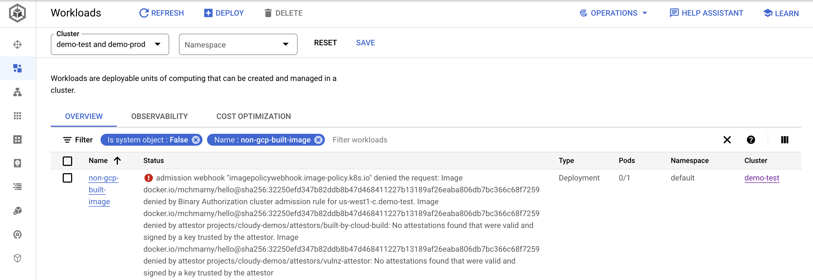
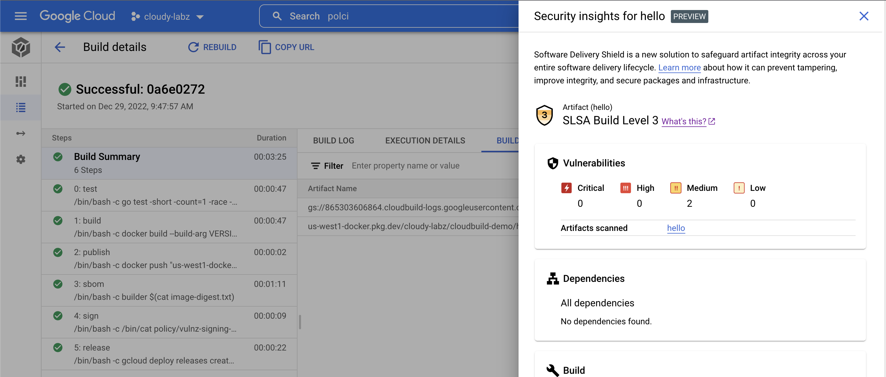
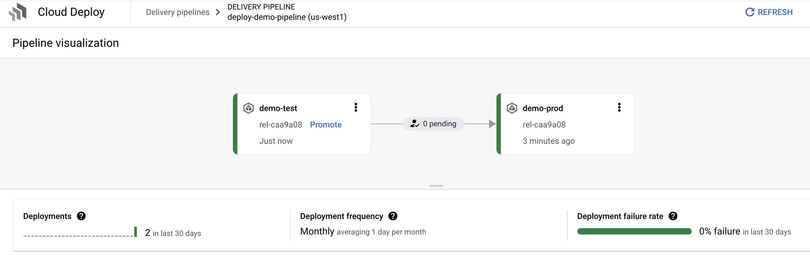
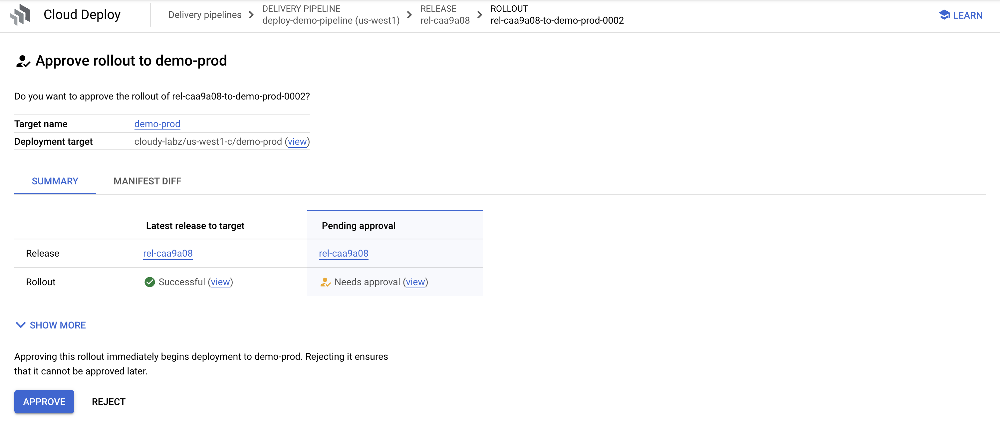
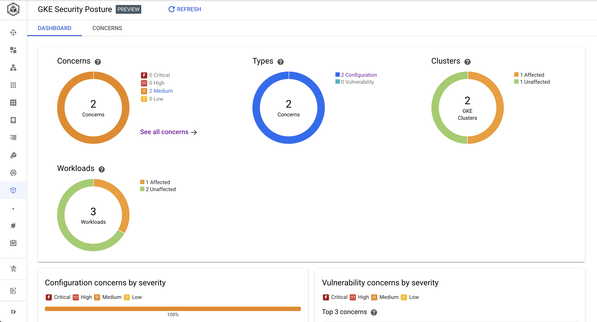

# GCP Secure CI/CD Pipeline Demo

This repo bootstraps a full CI/CD pipeline on Google Cloud to demonstrate policy controls for container image provenance, and for GKE authorization based on attestation. What's included:

* Cloud Build pipeline with on tag GitHub repo trigger and SBOM generation
* Test and Prod GKE clusters configured for Binary Authorization
* 2 Binary Authorization policies to ensure that images:
  * Have Cloud Build provenance (been built in GCB)
  * Meet minimal vulnerability validation policy (been successfully scanned using Kritis)
* 1 vulnerability signing policy with min fixable and un-fixable settings
* Artifact Registry registry with SLSA level 3 verification 
* Container analysis with vulnerability scanning and meta-data management 
* Cloud Deploy pipeline with approval-based test to prod promotion
* GKE security posture dashboard with Configuration concerns

## Requirements 

* [gcloud](https://cloud.google.com/sdk/docs/install)
* [jq](https://stedolan.github.io/jq/download/)

## Setup 

### Setup Environment  

Start by forking [this repo](https://github.com/mchmarny/cloudbuild-demo) into your GitHub Account. Navigate to https://github.com/mchmarny/cloudbuild-demo and click fork.

Next, clone that repo locally: 

```shell
git clone git@github.com:<your-github-username>/cloudbuild-demo.git
cd cloudbuild-demo
```

### Provision Resources 

To deploy this pipeline into your GCP project, you will also need to export the ID of target project:

```shell
export PROJECT_ID=<your-project-id-here>
```

Next, create the required GCP resources (KMS, Artifact Registry repo, and service account policies):

```shell
setup/init
```

Create GKE cluster:

```shell
setup/cluster
```

And, configure Binary Authorization:

```shell
setup/binauthz
```

Next, trust all Google-provided system images in UI (bottom):

https://console.cloud.google.com/security/binary-authorization/policy/edit

* Expand `Additional settings for GKE and Anthos deployments`
* Check `Trust all Google-provided system images`

> Still have not been able to figure out how to enable this programmatically.

Wait for cluster to be created:

> When ready, status will change from `PROVISIONING` to `RUNNING`

```shell
gcloud container clusters list --filter="resourceLabels.demo:build"
```

### Configure GCB Trigger 

Navigate to the triggers page, and go through the `Connect Repository` flow:

> The OAuth bit can't be scripted, so we have to do this manually.

https://console.cloud.google.com/cloud-build/triggers

The important bits:

* **Select source**: GitHub (Cloud Build GitHub App)
* Select repository
  * **GitHub Account**: this is your GitHub Username (should be populated after successful auth)
  * **Repository**: the newly cloned repo (`your-github-username/cloudbuild-demo`)
* **Create a trigger**: click DONE (we will script that part next)

#### Create Trigger

Create the GCP worker pool and the trigger on tag in the cloned app repo:

> Make sure to replace the `your-github-username` with your GitHub username.

```shell
setup/trigger <your-github-username>
```

Check that the trigger has been created: 

https://console.cloud.google.com/cloud-build/triggers

#### Enable Permissions 

Finally, navigate to GCB settings, and enable following permissions: 

> This is used in the demo later.

* Kubernetes Engine
* Cloud KMS
* Service Accounts
* Cloud Build

https://console.cloud.google.com/cloud-build/settings/service-account


## Demo

### Attestation Validation

Deploy sample image that **was not built in GCP**. The `apply` command will work because Kubernetes is declarative but as we will see in a minute, the workflow will fail to deploy.

```shell
kubectl apply -f test/non-gcp-built-image.yaml
```

* Navigate to GKE [workloads](https://console.cloud.google.com/kubernetes/workload/overview), and show how `non-gcp-built-image` failed to deploy due to lack of attestation (use cluster/namespace filters)
* Navigate to Security Policy and show [BinAuth Policy](https://console.cloud.google.com/security/binary-authorization/policy) rules
  * Vulnerability attestation (scanned and signed with KMS key)
  * Built in Cloud Build (attested with KMS key signature)
  * Show dry run and images exempt option on policy as a means to incremental rollout strategy



### Build on Tag (end-to-end demo)

* Show delivery pipeline config `app/clouddeploy.yaml`
* Make some code change
  * Edit API message in `route.go`
  * Bump version number in `.version`
* Git add, commit, push:

```shell
git add --all
git commit -m 'demo'
git push --all
```

* Git tag and push, to trigger the GCB pipeline:

```shell
export VERSION_TAG=$(cat app/.version)
git tag -s -m "demo" $VERSION_TAG
git push origin $VERSION_TAG
```

* Navigate to Cloud Build [triggers](https://console.cloud.google.com/cloud-build/triggers)
  * Push on tag (pattern)
  * Back in code, review config `app/cloudbuild.yaml`
  * Review the vulnerability scanner policy `policy/vulnz-signing-policy.yaml`


* Navigate to Cloud Build [builds](https://console.cloud.google.com/cloud-build/builds) in UI
  * Drill on active build 
  * Review steps (test, build, publish, scan, sign, sbom, release)
  * On Build Summary, show Build Artifacts > Image security insights ([SLSA Build Level 3](https://slsa.dev/spec/v0.1/levels))



* Navigate to Cloud Deploy [pipelines](https://console.cloud.google.com/deploy/delivery-pipelines)
  * Drill into `deploy-demo-pipeline`
  * Show 2 environments (test, prod)
  * Drill into the latest release 



* Navigate to GKE [workloads](https://console.cloud.google.com/kubernetes/workload/overview)
  * Drill into `hello` (note `non-gcp-built-image` erred due to lack of attestation)
  * Navigate to exposed service (`/api/ping`) and show version
* Back to Cloud Deploy [pipelines](https://console.cloud.google.com/deploy/delivery-pipelines) 
  * Show promotion and approval with manifest diffs and annotation comp (show more)



* Show GKE [Security Posture](https://console.cloud.google.com/kubernetes/security/dashboard)



## Cleanup 

```shell
setup/delete
```

## Disclaimer

This is my personal project and it does not represent my employer. While I do my best to ensure that everything works, I take no responsibility for issues caused by this code.