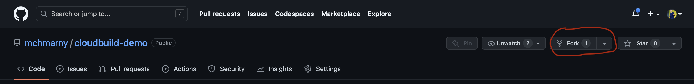
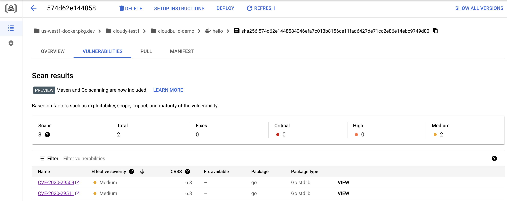
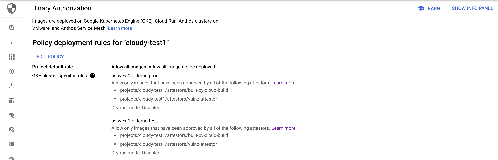

# GCP Secure CI/CD Pipeline Demo

This repo bootstraps a full CI/CD pipeline on Google Cloud to demonstrate policy controls for container image provenance, and for GKE authorization based on attestation. What's included:

* Cloud Build pipeline with on tag GitHub repo trigger and SBOM generation
* Test and Prod GKE clusters configured for Binary Authorization
* 2 Binary Authorization policies to ensure that images:
  * Have Cloud Build provenance (been built in GCB)
  * Meet minimal vulnerability validation policy (been successfully scanned using Kritis)
* 1 vulnerability signing policy with min fixable and un-fixable settings
* Artifact Registry registry with SLSA level 3 verification 
* Container analysis with vulnerability scanning and meta-data management 
* Cloud Deploy pipeline with approval-based test to prod promotion
* GKE security posture dashboard with Configuration concerns

## Requirements 

* GCP project with billing account
* [gcloud](https://cloud.google.com/sdk/docs/install)
* [jq](https://stedolan.github.io/jq/download/)


### Setup Environment  

Start by forking [this repo](https://github.com/mchmarny/cloudbuild-demo) into your GitHub Account. Navigate to https://github.com/mchmarny/cloudbuild-demo and click fork.



Next, clone that repo locally: 

```shell
git clone git@github.com:<your-github-username>/cloudbuild-demo.git
cd cloudbuild-demo
```

### Connect GitHub Repository 

There is one aspect of the deployment that can't be completed with Terraform. The connection to repo uses OAuth flow which has to be completed by an actual user. Before executing the Terraform deployment, make sure to complete the following steps: 

* Navigate to Cloud Build https://console.cloud.google.com/cloud-build
* Enable the API 
* Navigate to Connect Repository https://console.cloud.google.com/cloud-build/repos
  * Make sure you are using the correct **project/region** at the top left of the screen.
* Click `Connect Repository` to start the flow: 
  * **Select source**: GitHub (Cloud Build GitHub App)
  * Select repository
    * **GitHub Account**: this is your GitHub Username (should be populated after successful auth)
    * **Repository**: the newly cloned repo (`your-github-username/cloudbuild-demo`)
  * **Create a trigger**: click DONE (we will script that part next)

### Run Deployment 

Initialize Terraform (this is a one time step)

```shell
terraform -chdir=./deployment init
```

Next, apply the deployment to your project. When prompted, provide the requested information or use the defaults: 

* `root_name`         - used to contextualize all the resources created in the target project (default: `demo`)
* `project_id`        - target GPC project ID (not the name, although these can be the same)
* `region`            - target GCP region (default: `us-west1`)
* `zone`              - target GCP region zone, used for GCP cluster placement (default: `c`)
* `github_repo_owner` - your GitHub username (`https://github.com/<username>`)
* `github_repo_name`  - the name of the forked repo (default: `cloudbuild-demo`)

```shell
terraform -chdir=./deployment apply -auto-approve
```

## Demo

### Attestation Validation

Deploy sample image that **was not built in GCP**. First, get the configuration with which the demo clusters were configured:

```shell
. setup/config
```

Next, get the `test` cluster credentials:

```shell
gcloud container clusters get-credentials demo-test --region $CLUSTER_ZONE
```

Then `apply` command will work because Kubernetes is declarative but as we will see in a minute, the workflow will fail to deploy.

```shell
kubectl apply -f test/non-gcp-built-image.yaml
```

* Navigate to GKE [workloads](https://console.cloud.google.com/kubernetes/workload/overview), and show how `non-gcp-built-image` failed to deploy due to lack of attestation (use cluster/namespace filters  if needed).
  * The error should have names of the two attestors that valid deployments need to have in this cluster: `built-by-cloud-build` and `vulnz-attestor`
* Navigate to Security Policy and show [BinAuth Policy](https://console.cloud.google.com/security/binary-authorization/policy) rules
  * Vulnerability attestation (scanned and signed with KMS key)
  * Built in Cloud Build (attested with KMS key signature)
  * Show dry run and images exempt option on policy as a means to incremental rollout strategy


### Build on Tag (end-to-end demo)

* Show delivery pipeline config `app/clouddeploy.yaml`
* Make some code change
  * Make sure you bump version number in `app/.version`
* Git add, commit, push:

```shell
git add --all
git commit -m 'demo'
git push --all
```

* Git tag and push, to trigger the GCB pipeline:

```shell
export VERSION_TAG=$(cat app/.version)
git tag -s -m "demo" $VERSION_TAG
git push origin $VERSION_TAG
```

* Navigate to Cloud Build [triggers](https://console.cloud.google.com/cloud-build/triggers)
  * Push on tag (pattern)
  * Back in code, review config `app/cloudbuild.yaml`
  * Review the vulnerability scanner policy `policy/vulnz-signing-policy.yaml`


* Navigate to Cloud Build [builds](https://console.cloud.google.com/cloud-build/builds) in UI
  * Drill on active build 
  * Review steps (show sbom, scan, and attest running concurrently):
    * test - tests the code one more time
    * build - builds a docker image
    * publish - publishes that image to Artifact Registry
    * sbom - generates Software Bill of Materials for the published image
    * scan - scans image for culnerabilities (note: this step will fail if scanner finds vulnerabilities with severity higher than the max defined in `policy/vulnz-signing-policy.yaml`)
    * attest - creates and publishes attestation that this iamge was built in GCB using KMS key
    * release - deploys the image via Cloud Deploy
  * On Build Summary, show Build Artifacts > Image security insights ([SLSA Build Level 3](https://slsa.dev/spec/v0.1/levels))
    * Show `Dependencies` and `Build Provenance` YAMLs
  * Show in-toto attestation in CLI:

```shell
gcloud artifacts docker images describe $image_digest --show-provenance --format json | jq -r '.provenance_summary.provenance[0].envelope.payload' | base64 --decode | jq .
```


* Navigate to Artifact Registry [list of registries](https://console.cloud.google.com/artifacts)
  * Drill into `cloudbuild-demo/hello`
  * Show attestation and signature artifacts (`*.att` and `*.sig`)
  * Navigate to Manifest in `*.sig`, show cosign/signature
  * Navigate to the image (the one with the `v*` tag) and show Vulnerabilities



> Make sure the Cloud Build job completed before proceeding.

* Navigate to Cloud Deploy [pipelines](https://console.cloud.google.com/deploy/delivery-pipelines)
  * Drill into `deploy-demo-pipeline`
  * Show 2 environments (test, prod)
  * Drill into release, rollouts, and targets 


* Navigate to GKE [workloads](https://console.cloud.google.com/kubernetes/workload/overview)
  * Drill into `hello` (note `non-gcp-built-image` erred due to lack of attestation)
  * Navigate to exposed `hello` service at the bottom 
  * Click on endpoint, and show version using `/api/ping` (should be same as the version in `.version` file in the repo)


* Back to Cloud Deploy [pipelines](https://console.cloud.google.com/deploy/delivery-pipelines) 
  * Show promotion, review, and approval with manifest diffs and annotation comp (show more)


* Navigate to Binary Authorization [policy](https://console.cloud.google.com/security/binary-authorization/policy)
  * Show cluster specific rules, and edit policy
  * Show Custom exemption rules
  * Show GKE cluster-specific rules



* Show GKE [Security Posture](https://console.cloud.google.com/kubernetes/security/dashboard)
  * Show concerns (note: there may not be much, if you are using brand new project for this demo)


## Cleanup 

```shell
setup/delete
```

## Disclaimer

This is my personal project and it does not represent my employer. While I do my best to ensure that everything works, I take no responsibility for issues caused by this code.
